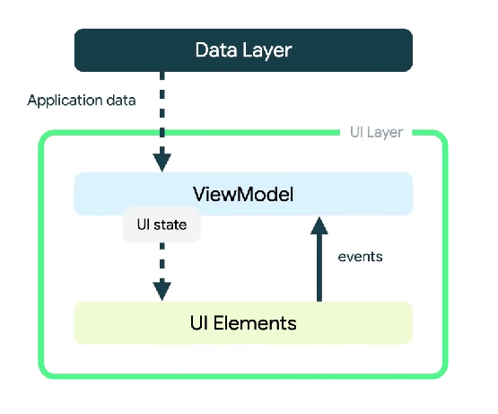

# Counter

## App Architecture

#### App Architecture: UI layer (MVVM)

- Model: UI state
- View: Fragment / Composable
- ViewModel
  \
  
  

#### App Navigation

- NavHost
- NavGraph
- NavController
- NavDestination
- Route
  \
  

